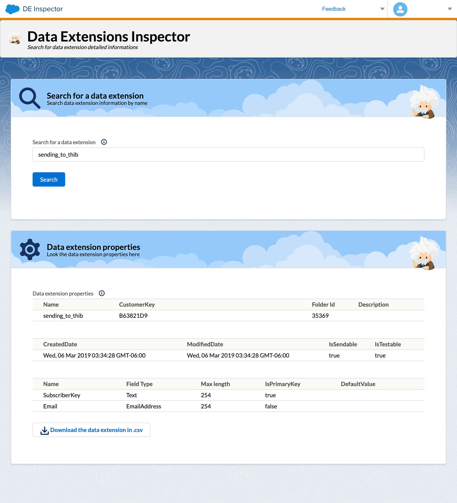

# DE Inspector

Search all the data extension from your MC account as you type. Diplays information about the DE such as the folder Id, or the fields infomations. There is also a `.csv ` option for exporting records. You can host this into a cloud page.




## FORM 

Form that retrieves all the data extension from you marketing cloud account and display it into a html `list` input. 

```html
<form action="" method="get">
    <label>
        <input list="deNameToSearch" name="deNameInput" class="slds-input">
    </label>
    <script runat="server">
        Platform.Load("Core", "1.1.1");
        try {
            // get all DEs names for the dropdown input
            var searchItem = Platform.Request.GetQueryStringParameter('deNameInput');
            var prox2 = new Script.Util.WSProxy();
            var objectType2 = "DataExtension";
            var cols2 = ["Name"];
            var filter2 = {
                Property: "Name",
                SimpleOperator: "notEquals",
                Value: "All Subscribers"
            };
            var allDes = prox2.retrieve(objectType2, cols2, queryAllAccounts);
            // generates htnl input
            Write('<datalist id="deNameToSearch">');
            for (var l = 0; l < allDes.Results.length; l++) {
                Write('<option value="' + allDes.Results[l].Name + '">');
            }
            Write('</datalist>');
            // create an AMPscript value to pass the variable values to the next SSJS code block
            Variable.SetValue("@searchItem", searchItem);
        } catch (ex) {
            Write("error message: " + ex);
        }
        </script>
    <input class="slds-button slds-button_brand slds-m-top_large" id="deButtonToSearch" type="submit" value="Search">
</form>
```

Once `enter` key or the submit button pressed this will genereate a AMPscript varialble that will be used by the next SSJS script.


## SSJS OUTPUT DE PROPERTIES

Searches the returned data extension properties and output it into HTML tables.

```html
<script runat="server">
Platform.Load("Core", "1.1.1");
try {
    var prox1 = new Script.Util.WSProxy();
    var searchItemVal1 = Variable.GetValue("@searchItem");
    // indicating the properties of the DE according to the SOAP API data extension object
    var cols1 = ["Name", "CustomerKey", "CategoryID", "IsSendable", "IsTestable", "CreatedDate", "ModifiedDate", "Description"];
    var filter1 = {
        Property: "Name",
        SimpleOperator: "equals",
        Value: searchItemVal1
    };
    // retrieve the fields informations
    var desc = prox1.retrieve("DataExtension", cols1, filter1);
    var CustKeyStr = Platform.Function.Stringify(desc.Results[0].CustomerKey);
    var myDe = DataExtension.Init(desc.Results[0].CustomerKey);
    var fields = myDe.Fields.Retrieve();
    // ROWS retrieve for the CSV export
    var deRecords = myDe.Rows.Retrieve();
    var stringDeRecords = Stringify(deRecords);
    Variable.SetValue("@ampDeRecords", stringDeRecords);
    // Get the DE name, for the csv file too
    var deName = desc.Results[0].Name;
    Variable.SetValue("@ampDeName", deName);

    // outputs the results into HTML tables using SLDS
    Write('<table class="slds-table slds-table_cell-buffer slds-table_bordered"> <thead> <tr class="slds-line-height_reset"> <th class="" scope="col"> <div class="slds-truncate" title="Name">Name</div> </th> <th class="" scope="col"> <div class="slds-truncate" title="CustomerKey">CustomerKey</div> </th> <th class="" scope="col"> <div class="slds-truncate" title="Folder Id">Folder Id</div> </th> <th class="" scope="col"> <div class="slds-truncate" title="Description">Description</div> </th> </tr> </thead> <tbody>');
    Write('<tr class="slds-hint-parent">');
    Write('<td data-label=""><div class="slds-truncate" title="">' + desc.Results[0].Name + '</div></td>');
    Write('<td data-label=""><div class="slds-truncate" title="">' + desc.Results[0].CustomerKey + '</div></td>');
    Write('<td data-label=""><div class="slds-truncate" title="">' + desc.Results[0].CategoryID + '</div></td>');
    Write('<td data-label=""><div class="slds-truncate" title="">' + desc.Results[0].Description + '</div></td>');
    Write('</tr>');
    Write('</table>');
    Write('<br><br>');

    Write('<table class="slds-table slds-table_cell-buffer slds-table_bordered"> <thead> <th class="" scope="col"> <div class="slds-truncate" title="Created Date">CreatedDate</div> </th> <th class="" scope="col"> <div class="slds-truncate" title="Modified Date">ModifiedDate</div> </th> <th class="" scope="col"> <div class="slds-truncate" title="Is Sendable">IsSendable</div> </th> <th class="" scope="col"> <div class="slds-truncate" title="Is Testable">IsTestable</div> </th> </thead> <tbody>');
    Write('<td data-label=""><div class="slds-truncate" title="">' + desc.Results[0].CreatedDate + '</div></td>');
    Write('<td data-label=""><div class="slds-truncate" title="">' + desc.Results[0].ModifiedDate + '</div></td>');
    Write('<td data-label=""><div class="slds-truncate" title="">' + desc.Results[0].IsSendable + '</div></td>');
    Write('<td data-label=""><div class="slds-truncate" title="">' + desc.Results[0].IsTestable + '</div></td>');
    Write('</tr>');
    Write('</table>');
    Write('<br><br>');


    Write('<table class="slds-table slds-table_cell-buffer slds-table_bordered"><thead><tr class="slds-line-height_reset"><th class="" scope="col"><div class="slds-truncate" title="">Name</div></th><th class="" scope="col"><div class="slds-truncate" title="">Field Type</div></th><th class="" scope="col"><div class="slds-truncate" title="">Max length</div></th><th class="" scope="col"><div class="slds-truncate" title="">IsPrimaryKey</div></th><th class="" scope="col"><div class="slds-truncate" title="">DefaultValue</div></th></tr></thead><tbody>');
    for (var i = 0; i < fields.length; i++) {
        Write("<tr>");
        Write("<td>" + fields[i].Name + "</td>");
        Write("<td>" + fields[i].FieldType + "</td>");
        Write("<td>" + fields[i].MaxLength + "</td>");
        Write("<td>" + fields[i].IsPrimaryKey + "</td>");
        Write("<td>" + fields[i].DefaultValue + "</td>");
        Write("</tr>");
    }
    Write('</tbody></table>');

} catch (ex) {
    Write("error message: " + ex);
}
</script>
```


## EXPORT TO CSV

Get the data extensions rows thanks to the `ampDeRecords` variable and generates a `.csv` file with the searched data extension name

```html
<script>
// set the DE rows out put as JSON
var json = %%=v(@ampDeRecords)=%% ;
var fields = Object.keys(json[0])
var replacer = function(key, value) { return value === null ? '' : value }
var csv = json.map(function(row) {
    return fields.map(function(fieldName) {
        return JSON.stringify(row[fieldName], replacer)
    }).join(',')
})
// add header column
csv.unshift(fields.join(',')) 

console.log(csv.join('\r\n'))

// Download function
function downloadcsv() {
    var hiddenElement = document.createElement('a');
    hiddenElement.href = 'data:text/csv;charset=utf-8,' + encodeURI((csv.join('\r\n')));
    hiddenElement.target = '_blank';
    // set the name of the file according to the name of the DE
    hiddenElement.download = '%%=v(@ampDeName)=%%.csv';
    hiddenElement.click();
}
</script>
<button class="slds-button slds-button_neutral" onclick="downloadcsv()"><b>Download the data extension in .csv</b></button>
```


## RESOURCES USED

- [Server Side JavaScript](https://developer.salesforce.com/docs/atlas.en-us.mc-programmatic-content.meta/mc-programmatic-content/ssjs_syntaxGuide.htm)
- [WSProxy](https://developer.salesforce.com/docs/atlas.en-us.mc-programmatic-content.meta/mc-programmatic-content/ssjs_WSProxy_useSSJS.htm)
- [Data extension retrieve](https://developer.salesforce.com/docs/atlas.en-us.mc-programmatic-content.meta/mc-programmatic-content/ssjs_dataExtensionRetrieve.htm)
- [Get and Set values](https://developer.salesforce.com/docs/atlas.en-us.mc-programmatic-content.meta/mc-programmatic-content/ssjs_platformAMPscriptVariableGetValue.htm)
- [Stringify](https://developer.salesforce.com/docs/atlas.en-us.mc-programmatic-content.meta/mc-programmatic-content/ssjs_platformUtilityStringify.htm)
- [Data Extension Object ref](https://developer.salesforce.com/docs/atlas.en-us.mc-apis.meta/mc-apis/dataextension.htm)
- [SLDS](https://www.lightningdesignsystem.com/)
